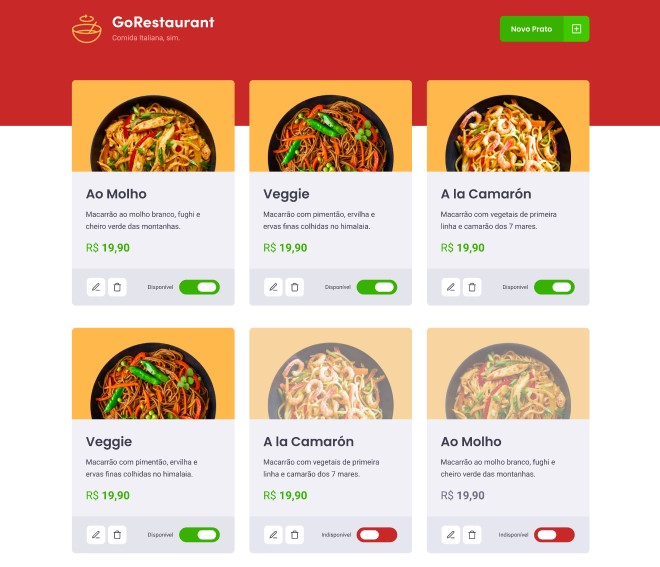

# 🚀 Desafio GoStack: GoRestaurant Web
Este é um desafio do bootcamp GoStack, da Rocketseat. Trata-se de uma aplicação que se conecta a uma fake API, exibindo os pratos de comida criados e permitindo a criação, remoção e atualização desses pratos.

## ⚙️ Tecnologias
- React
- TypeScript
- Axios
- Unform
- Styled-components
- ESLint e Prettier

## 🤔 Como contribuir

- Faça um fork desse repositório;
- Crie uma branch com as suas alterações: `git checkout -b my-feature`;
- Commit suas alterações: `git commit -m 'feat: my new feature'`;
- Faça um push para a sua branch: `git push origin my-feature`.

## 📜 Licença

> Este projeto está sob a licença MIT. Veja o arquivo [LICENSE](https://github.com/jessicafpx/gostack-desafio-GoRestaurant-web/blob/master/LICENSE.md) para mais detalhes.

---

##### 
 <strong> < desenvolvido por <a href="github.com/jessicafpx"> @jessicafpx</a> /></strong> 👋
